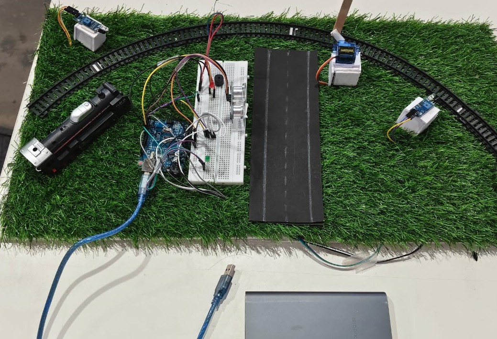

# 🚉 Automated Railway Gate Control System
### Arduino Uno | Embedded Safety System | Smart India Hackathon 2025

---

## 📸 Project Demo



> *Real working model built using Arduino Uno, IR sensors, ultrasonic sensor, servo motor, and LED indicators on a miniature railway track.*

---

## 📋 Project Overview

An **Automated Railway Gate Control System** that automatically opens and closes railway level crossing gates when a train approaches or departs — eliminating the need for manual gatekeepers and reducing accidents.

Built and demonstrated as part of **Smart India Hackathon 2025 (SIH)** at Karpagam College of Engineering, Coimbatore.

---

## 🎯 Objectives

- Prevent accidents at unmanned railway crossings
- Eliminate dependency on manual gate operators
- Ensure timely and reliable gate operation
- Provide visual and audio warning signals to road users
- Detect obstacles on the track and respond safely

---

## ⚙️ How It Works

```
Train Approaching
      ↓
IR Arrival Sensor Detects Train
      ↓
🔴 Red LED ON | Buzzer Beeps (5 times)
      ↓
Servo Motor → Gate CLOSES (90° → 0°)
      ↓
Ultrasonic Sensor monitors for obstacles
      ↓
If obstacle detected → Gate opens temporarily → closes again
      ↓
IR Exit Sensor Detects Train Leaving
      ↓
🟢 Green LED ON | Servo → Gate OPENS (0° → 90°)
```

---

## 🔧 Hardware Components

| Component | Pin | Purpose |
|---|---|---|
| Arduino Uno | - | Main microcontroller |
| IR Sensor (Arrival) | Pin 2 | Detects train approaching |
| IR Sensor (Exit) | Pin 3 | Detects train leaving |
| Servo Motor | Pin 9 | Opens/closes gate barrier |
| Buzzer | Pin 6 | Audio warning signal |
| Red LED | Pin 7 | Gate CLOSED indicator |
| Green LED | Pin 8 | Gate OPEN indicator |
| HC-SR04 Trig | Pin 4 | Ultrasonic trigger |
| HC-SR04 Echo | Pin 5 | Ultrasonic echo (obstacle detection) |

---

## 💡 Key Features

- ✅ **Fully automatic** gate control — no manual operation needed
- ✅ **Dual IR sensors** — separate detection for arrival and exit
- ✅ **Ultrasonic obstacle detection** — gate opens temporarily if someone is stuck
- ✅ **Beep-style buzzer warning** — 5 beeps before gate closes
- ✅ **Visual LED indicators** — Red (closed) / Green (open)
- ✅ **Serial monitor logging** — real-time status messages
- ✅ **Custom servo control** — implemented without Servo library using pulse width

---

## 📦 Software & Libraries

- **Arduino IDE**
- **Language:** Embedded C / C++
- No external libraries required — servo controlled manually via PWM pulses

---

## 🔌 Pin Configuration

```cpp
#define IR_SENSOR_ARRIVAL  2
#define IR_SENSOR_EXIT     3
#define SERVO_PIN          9
#define BUZZER             6
#define RED_LED            7
#define GREEN_LED          8
#define TRIG_PIN           4
#define ECHO_PIN           5
```

---

## 🚦 System States

| State | Red LED | Green LED | Buzzer | Gate |
|---|---|---|---|---|
| Idle (no train) | OFF | ON | OFF | OPEN (90°) |
| Train arriving | ON | OFF | Beeping | CLOSING |
| Train crossing | ON | OFF | OFF | CLOSED (0°) |
| Obstacle detected | ON | OFF | OFF | OPENS temporarily |
| Train exited | OFF | ON | OFF | OPEN (90°) |

---

## 📁 Repository Structure

```
EMBEDDED-SYSTEM-PROJECT/
│
├── Smart Railway Gate Safety System    → Arduino .ino code
├── README.md                           → Project documentation
└── WIN_20250826_15_37_57_Pro.jpg       → Project photo
```

---

## 🏆 Event

> **Smart India Hackathon 2025 (SIH)**  
> Karpagam College of Engineering, Coimbatore  
> Team project — Jul 2025 to Nov 2025

---

## 🔮 Future Enhancements

- 📱 IoT-based remote monitoring via mobile app
- 📡 GSM alert system to notify authorities
- 🤖 AI-based train detection using computer vision
- 🔗 Integration with railway signaling systems
- ☀️ Solar-powered operation for remote crossings

---

## 👨‍💻 Author

**Aswin Kumar V**  
B.E. Electronics and Communication Engineering  
Karpagam College of Engineering, Coimbatore  
🔗 GitHub: [Aswinkumar000](https://github.com/Aswinkumar000)  
🔗 LinkedIn: [aswinkumar-v-462075331](https://linkedin.com/in/aswinkumar-v-462075331)

